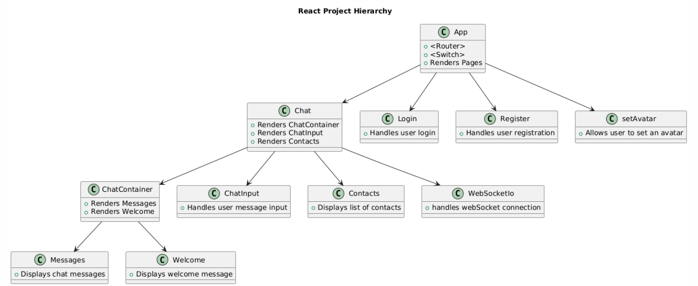

# BlabberBuzz

## Tech Stack

- **Frontend**: ReactJs
- **Backend**: NodeJs, ExpressJs
- **Database**: MongoDB

## Features

- Implemented SignUp and Login system
- Secured user information in the backend using the `bcrypt` library
- Avatar selection by utilizing the Multiavatar API to fetch random avatar SVGs for user selection
- Option to send and receive messages from multiple users
- Real-time messaging using WebSocket API
- User-friendly interface utilizing styled components in React
- Utilized Local Storage API to store some data on the browser
